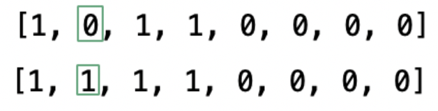
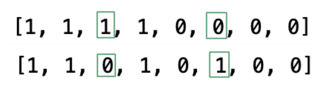
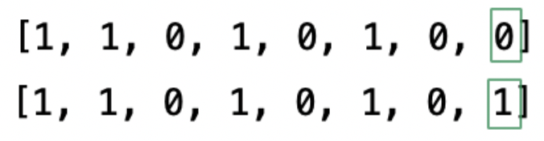
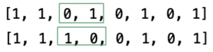
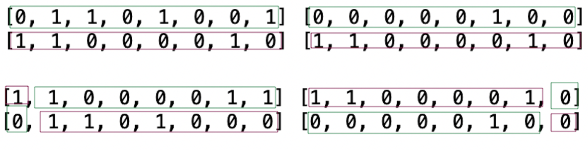
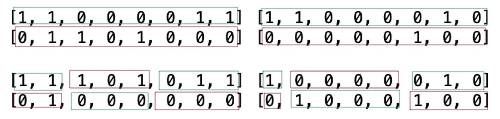
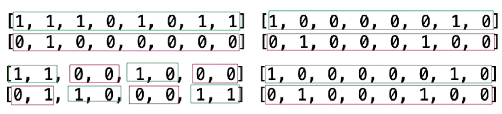
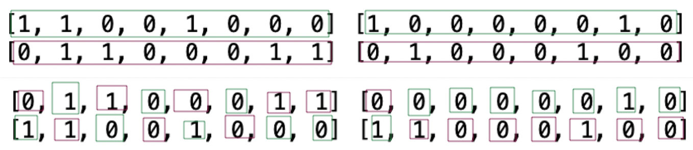
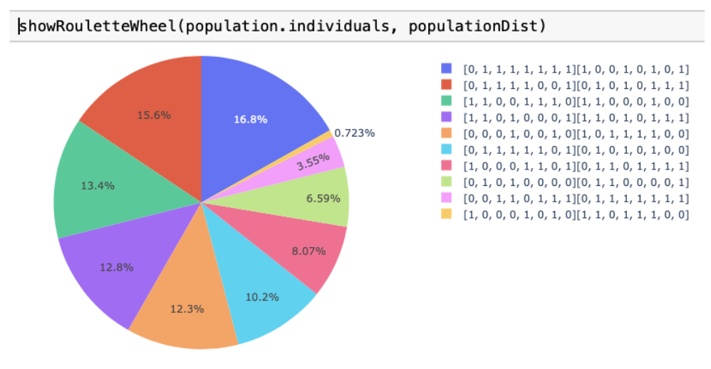

# Classic genetic alghoritm
Genetic algorithm solving the problem of optimization - minimization Booth function

### Technologies
* Python
* Anaconda (Jupyter Notebook)

### Modules
* ipywidgets
* ipynb
* plotly
* matplotlib
* pandas

### Description
* The chromosome is represented in binary or decimal representation with the accuracy of a certain number of significant digits
* Every individual has two chromosomes: X and Y
* The population consists of a specific number of individuals
* The range of sought solutions is from -10 to 10

### Genetic operators

#### Mutation

##### o One-point mutation

  
 

 
##### o Two-points mutation

  
 

 
##### o Edge mutation

  
 

 
##### o Inversion

  
 

 
#### Crossover

##### o One-point crossover

  
 

##### o Two-points crossover

  
 

 
##### o Three-point crossover

  
 

 
##### o Uniform crossover

  
 

 
 #### Selection

##### o Tournament selection

##### o The best selection

##### o Roulette wheel selection

  
 

